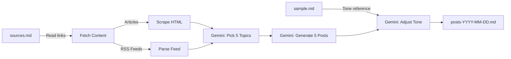

# LinkedIn Post Generation Workflow

## Architecture

## Files

| File | Purpose |
|------|---------|
| `generate_posts.py` | Main workflow script |
| `requirements.txt` | Dependencies |
| `sources.md` | Content source links (1 per line, supports articles + RSS feeds) |
| `sample.md` | Example LinkedIn posts in Finnish for tone-of-voice matching |

## How It Works

### `generate_posts.py` - Main Script

The script runs in 5 stages:

1. **Parse sources.md** -- Read all lines, skip blanks/comments. Auto-detect whether each URL is an RSS feed (by URL patterns like `/feed`, `/rss`, `.xml`) or a regular article.

2. **Fetch and extract content** -- For articles: use `requests` + `BeautifulSoup` to scrape title + main text. For RSS feeds: use `feedparser` to get recent entries (title + summary + link). Collect everything into a list of source summaries.

3. **Pick 5 trending topics** -- Send all source summaries to Gemini in a single prompt asking it to identify the 5 most currently popular/trending topics. Gemini returns a numbered list with topic title, description, and source URLs. Output is in Finnish.

4. **Generate and tone-match posts** -- For each of the 5 topics, Gemini generates a LinkedIn post draft in Finnish. Then `sample.md` is loaded, and in a second Gemini call, all 5 posts are refined to match the writing style, tone, humor, and formatting patterns found in the sample. Posts are 150-250 words each.

5. **Write output** -- Final posts are saved to `posts-YYYY-MM-DD.md`.

### API Integration

- Uses the **Gemini REST API directly** (no SDK) to avoid SSL/gRPC issues on corporate/school networks.
- SSL verification is disabled (`verify=False`) as a workaround for proxy/firewall environments.
- Automatic retry with exponential backoff on 429 (rate limit) errors.
- Clear error messages for 404 (model not found) with a `--list-models` helper.

### Configuration

| Constant | Default | Description |
|----------|---------|-------------|
| `MODEL` | `gemini-3-pro-preview` | Gemini model to use |
| `MAX_ARTICLE_CHARS` | `3000` | Max characters to extract per article |
| `MAX_FEED_ENTRIES` | `10` | Max recent entries to pull per RSS feed |

- The Google API key is read from the `GOOGLE_API_KEY` environment variable.
- Output language is Finnish (configured in the prompts).

### Commands

| Command | Description |
|---------|-------------|
| `python generate_posts.py` | Run the full workflow |
| `python generate_posts.py --list-models` | List available Gemini models for your API key |

### Dependencies (`requirements.txt`)

- `requests` -- HTTP fetching + Gemini REST API calls
- `beautifulsoup4` -- HTML parsing
- `feedparser` -- RSS feed parsing
- `lxml` -- HTML/XML parser backend
