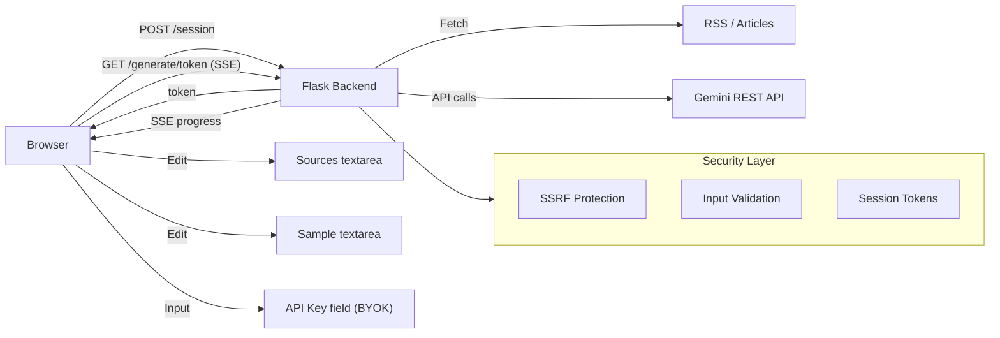

# Web UI for LinkedIn Post Generator

## Architecture



A public-facing web app split into a standalone dark-mode HTML frontend and a Flask API backend in `web/linked-ai/`. Visitors bring their own Gemini API key (BYOK model), edit sources and sample posts, and generate LinkedIn posts. The server never stores API keys or user data.

## File Structure

```
web/
  linked-ai.html         -- Standalone dark-mode frontend (can live in web root)
  linked-ai/             -- Flask API backend
    linked-ai.py         -- Flask server with security middleware
    wsgi.py              -- WSGI entry point (Gunicorn / mod_wsgi)
    requirements.txt     -- Flask + dependencies
    sources.md           -- Default source URLs
    sample.md            -- Default sample posts (Finnish)
  DEPLOYMENT.md          -- Production deployment guide
  workflow.md            -- This plan saved as documentation
  README.md              -- Web app usage guide
```

## Security Model

Since this is public-facing, security is critical. The approach is **BYOK (Bring Your Own Key)** — the server never holds any API keys.

### Protections

1. **API key never stored** — The visitor's Gemini key is sent via POST to `/session`, used only for that generation run, and immediately discarded after the session is consumed. Never logged, never written to disk, never in URLs.

2. **Session tokens** — API keys are exchanged for short-lived, single-use tokens via `POST /session`. The SSE endpoint (`GET /generate/<token>`) only receives the opaque token, keeping secrets out of URLs and server logs. Tokens are stored in Redis (production) or in-memory (dev) and expire after 5 minutes.

3. **SSRF prevention** — The server fetches URLs provided by visitors (sources). To prevent Server-Side Request Forgery:

   - Resolve hostnames before fetching and block private/internal IP ranges (127.0.0.0/8, 10.0.0.0/8, 172.16.0.0/12, 192.168.0.0/16, 169.254.0.0/16, ::1)
   - Only allow `http://` and `https://` schemes
   - Block requests to `localhost`, `0.0.0.0`, and metadata endpoints (169.254.169.254)
   - Re-check each redirect hop to prevent SSRF bypass via redirects

4. **Input validation**:

   - Max 20 source URLs per request
   - Max 10,000 characters for sample text
   - Max 100KB total request payload
   - URL format validation (must start with http:// or https://)
   - Model name validated with regex (`^[a-zA-Z0-9._-]+$`)

5. **Request timeouts** — Each generation run has a hard timeout (5 minutes) to prevent resource exhaustion

6. **No file system writes** — Generated posts are returned in the response only, never saved to disk on the server

7. **Security headers** — X-Content-Type-Options, X-Frame-Options, X-XSS-Protection, Referrer-Policy headers set on all API responses

8. **SSL verification** — Enabled in production; can be disabled with `--dev` flag for corporate proxy environments

## Frontend (`linked-ai.html`)

- Standalone dark-mode layout using Tailwind CSS (via CDN)
- **API Key field** (password input with a note explaining BYOK — "Your key is sent securely via POST and never stored")
- **Model selector** — pre-populated with popular models; "Fetch my models" button loads all models available on the user's API key via `POST /models`
- **Sources textarea** — pre-filled with defaults from `/defaults` endpoint, editable; client-side validation for max 20 URLs
- **Sample Posts textarea** — pre-filled with defaults from `/defaults` endpoint, editable
- **Generate button** — triggers the workflow; disabled while running
- **Progress panel** — shows real-time stage updates via Server-Sent Events (SSE)
- **Results panel** — displays the 5 generated posts in formatted cards, with "Copy" per post and "Copy All"
- API key stored in `sessionStorage` only (cleared when tab closes, never in localStorage)
- Default model: `gemini-flash-latest`

## Backend (`linked-ai/linked-ai.py`)

### Endpoints

| Method | Path | Description |
|--------|------|-------------|
| `GET` | `/defaults` | Returns default sources, sample text, default model, and popular model list as JSON |
| `POST` | `/session` | Accepts `api_key`, `sources`, `sample`, `model` in JSON body; validates all inputs and SSRF-checks URLs; returns a single-use `token` |
| `POST` | `/models` | Accepts `api_key` in JSON body; fetches available generative models from Gemini API |
| `GET` | `/generate/<token>` | SSE endpoint — consumes the session token, runs the full pipeline, streams progress events and final posts |

### Pipeline (inside `/generate/<token>`)

1. **Fetch content** — fetches all source URLs (RSS feeds + articles) with SSRF-safe redirects
2. **Pick topics** — Gemini identifies 5 trending topics from the content (in Finnish)
3. **Generate posts** — Gemini writes a LinkedIn post for each topic (in Finnish)
4. **Adjust tone** — Gemini rewrites posts to match the user's sample tone of voice (in Finnish)
5. **Stream result** — final posts sent as SSE `result` event

### Session Storage

- **Production**: Redis (`REDIS_URL` env var, defaults to `redis://localhost:6379`)
- **Development**: In-memory dict with background cleanup thread
- Tokens are single-use (consumed on first access) and expire after 5 minutes

## Running

### Development

```bash
cd web/linked-ai
pip install -r requirements.txt
python linked-ai.py --dev
```

Open `linked-ai.html` in your browser. The API runs on http://localhost:5000.

### Production

Deploy with Gunicorn behind Apache or Nginx. See `DEPLOYMENT.md` for full step-by-step instructions.

```bash
cd web/linked-ai
pip install -r requirements.txt
gunicorn wsgi:application --bind 127.0.0.1:8000 --workers 2 --timeout 300
```

## Key Decisions

- **BYOK (Bring Your Own Key)** — visitors use their own Gemini API key; no server-side key needed
- **Session tokens** — API keys never appear in URLs or server logs; exchanged for short-lived tokens stored in Redis
- **No rate limiting** — since users bring their own API keys, rate limiting is handled by Google's own quotas
- **SSE for progress** — streams status updates back to the browser in real time
- **SSRF protection** — critical since the server fetches user-provided URLs; redirect hops are re-checked
- **Split architecture** — HTML frontend and Flask API can be deployed independently
- **Tailwind via CDN** — no build step
- **Dark mode** — modern dark UI with Tailwind CSS
- **Finnish output** — posts are generated in Finnish by default (configurable in prompts)
- **Redis for sessions** — shared across Gunicorn workers in production; graceful in-memory fallback for dev
